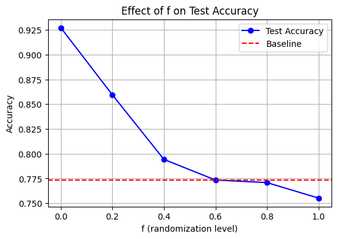

# **Surrogate Gradient Descent and Spike Timing Analysis**

## **Overview**
This project investigates how well surrogate gradient descent can learn from spike timing information in a spiking neural network (SNN). We analyze the impact of partial randomization of spike times on model performance, gradually removing timing information and evaluating its effect on accuracy.

## **What Has Been Done**
### **1. Data Generation & Preprocessing**
- Created a synthetic dataset where neurons fire in pairs with a fixed interspike interval (ISI).
- Transformed the data into firing rates and ISI representations.
- Implemented a function to **partially randomize spike timings** by a fraction `f`, controlling the level of temporal information degradation.

### **2. Model Training**
- Designed and trained **Multilayer SNNs** using surrogate gradient descent.
- Trained models for different values of `f` (from 0 to 1) to observe performance changes.
- Ensured reproducibility by fixing random seeds and using consistent weight initialization.

### **3. Evaluation & Visualization**
- Tested accuracy across different `f` values and plotted the **accuracy degradation curve**.
- Added a **baseline accuracy line** to compare models with a rate-based classifier.
- Examined whether SNNs could still learn meaningful representations without precise spike timings.

## **Next Steps**
### **1. Further Experiments**
- Test on a more complex dataset (e.g., SHD dataset for auditory classification).
- Evaluate other coding schemes (e.g., **coincidence detection** instead of ISI-based coding).
  
### **2. Theoretical Analysis**
- Compare the empirical results with an **ideal classifier** to determine theoretical upper bounds.
- Investigate the stability of surrogate gradient learning when temporal precision is disrupted.

### **3. Robustness Testing**
- Introduce **Gaussian noise** to spike times and observe its effect.
- Explore different randomization strategies beyond uniform jittering.
