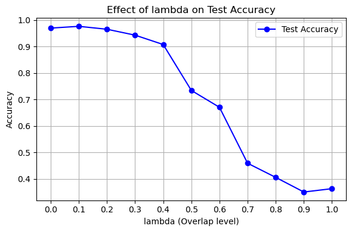

# **Surrogate Gradient Descent and Spike Timing Analysis**

## Overview

This project explores how effectively **surrogate gradient descent** can train spiking neural networks (SNNs) under various **spike encoding** strategies and **temporal noise** levels. It focuses on understanding the impact of disrupting **precise spike timing** on classification performance.

The project consists of **three steps**, each representing a unique experimental setup.

---

## Step 1: ISI-Based Spike Timing Coding (`step1_isi.ipynb`)

### Dataset  
- Synthetic spike trains were created where neurons fire in pairs with a fixed interspike interval (ISI), encoding class information.
- A parameter `f` controls the level of temporal randomization applied to spike timings.

### Results  
- SNNs were trained using surrogate gradient descent across multiple values of `f` (from 0 to 1).
- Test accuracy drops significantly as `f` increases, indicating that **ISI-based timing information** is crucial.
- Comparison with a rate-based baseline shows SNNs perform better when timing is intact.

### Insights  
- ISI-based temporal structure encodes essential class-discriminative information.
- Even minor disruption to spike timing impairs performance, emphasizing the importance of **precise temporal coding**.

---

## Step 2: Coincidence Coding with Overlap (`step2_coin.ipynb`)

### Dataset  
- A custom dataset simulates spike count overlap between neuron pairs across classes.
- The overlap level is parameterized by `λ` (lambda), which controls the coincidence ratio among class prototypes.

### Results  
- As `λ` increases, spike distribution overlap across classes grows.
- SNN test accuracy degrades with higher `λ`, as shown in the following plots.

**Spike Count Distributions per Class:**  

**Test Accuracy vs. Lambda:**  

### Insights  
- The experiment highlights how **class separability in spike patterns** affects SNN learning.
- Coincidence-based coding is effective when spike counts are sufficiently distinguishable; overlap causes confusion.

---

## Step 3: Real Auditory Dataset (SHD) (`step3_shd.ipynb`)

###  Dataset  
- The **Spiking Heidelberg Digits (SHD)** dataset was used, consisting of auditory digit classification encoded in spike trains.
- Spike trains were partially randomized using parameter `f ∈ [0.0, 1.0]` to assess robustness to timing noise.

### Results  
- Models were trained for different levels of `f`.
- As `f` increases, performance steadily declines.

**Effect of f on Test Accuracy:**  

### Insights  
- SNNs trained with surrogate gradients **exploit temporal information** in real spike trains.
- Performance degradation with randomized spike timing shows real-world datasets also benefit from **precise spike structure**.